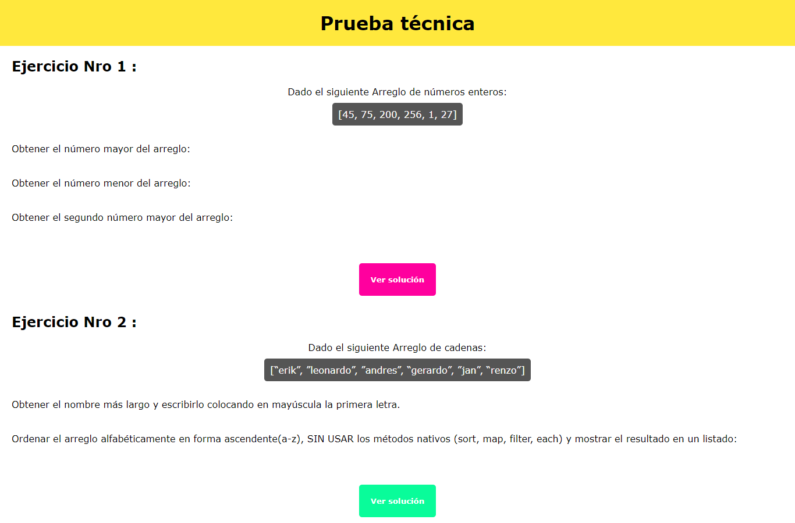
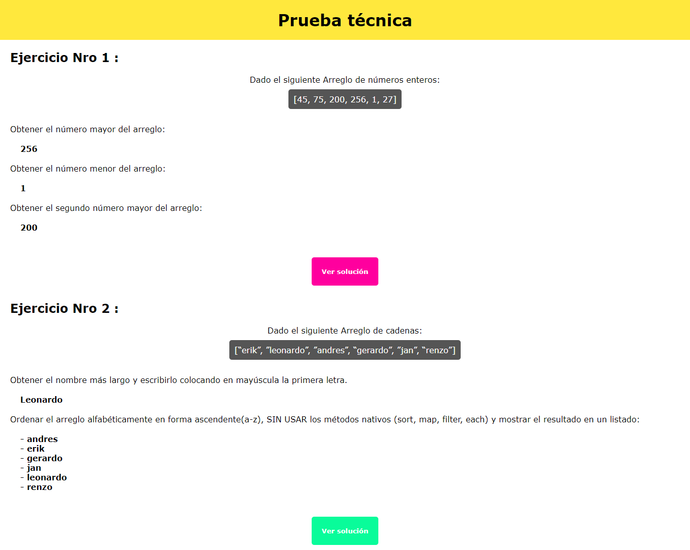

# Prueba Técnica :

* **Empresa:** _El Comercio_

***

## Introducción :
Este repositorio consiste en mostrar las habilidades técnicas (JS) a travéz de la resolución de los problemas planteados .

## PLAN DE TRABAJO :

El repositorio se realizó en 3 días y para ello se propuso dividir el proyecto en una serie de etapas que se detallarán a continuación :

#### ETAPA 1 :
* Plantear la lógica inicial de los problemas.

#### ETAPA 2 :

* Plasmar la lógica en código .

### ETAPA 3 :
* Refactorizar y mejorar la estructura del código.
* Agregar estilos

### ETAPA 4 :

* Versión final README.

## Archivos importantes

El proyecto presenta los siguientes archivos para uso del usuario:

* `README.md` con descripción del repositorio, imagenes del mismo y organización.
* `index.html`: Donde se encuentra la vista con las respuestas de los ejercicios.
* `main.css`: Archivo css que contiene los estilos del proyecto.
* `app.js`: Contiene toda la funcionalidad de la pagina principal, así como la ejecución de las funciones desarrolladas para llegar a los resultados requeridos.
* `exercise-1.js`: Contiene la lógica del desarrollo del primer problema encapsulada en funciones.
* `exercise-2.js`: Contiene la lógica del desarrollo del segundo problema encapsulada en funciones.

## Imagenes del proyecto :
* Vista principal:

* Vista con ejercicios resueltos :

## Autora

* Manuela Flores Vilchez [Cuenta GitHub ](https://github.com/Manu160296 "titulo")
